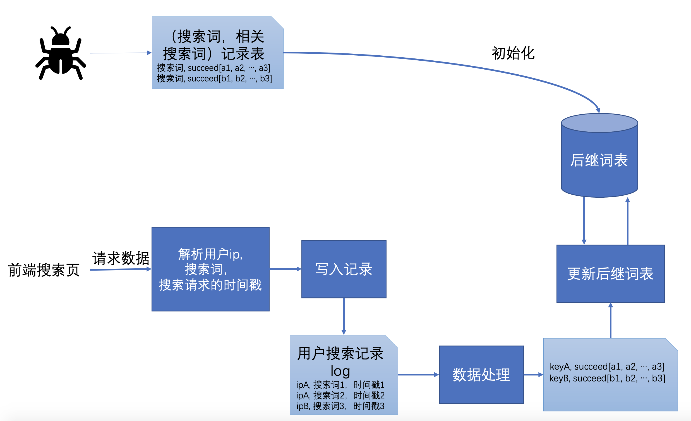

# 索引
RelatedStorage存储初始后词表的数据，key=关键词，val={关键词，后继词数组}

# 搜索
## 相关搜索推荐

### 功能介绍
1. 用户搜索后返回推荐的相关搜索短语。
2. 搜索引擎记录用户搜索历史的log，根据log收集用户搜索行为，更新后继词表。
    - 后继词表更新触发方式一：定时任务
    - 后继词表更新触发方式二：api调用接口
        - 后继词表更新，并清除用户搜索历史的log
            ```
            curl http://127.0.0.1:5678/api/searchlog/update?ic=clear
            ```
        - 后继词表更新，保留用户搜索历史的log
            ```
            curl http://127.0.0.1:5678/api/searchlog/update?ic=非clear
            ```

### 实现细节


- 更新后继词表的触发条件
    - 方法1:定时任务
    - 方法2:api接口调用 

- 用户输入搜索词获取相关搜索词
    - 搜索词、搜索词分词结果作为key查询后继词表，返回后继词即相关搜索推荐词


